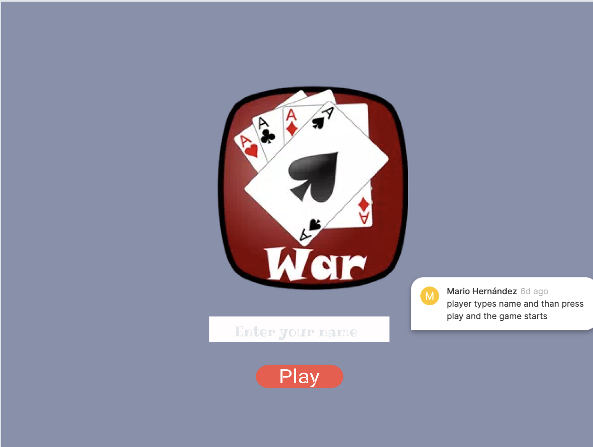
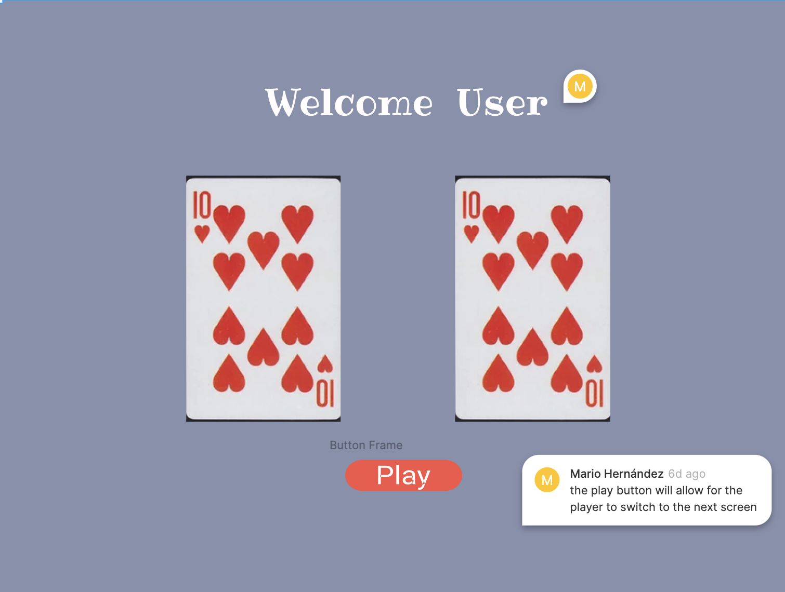

# Project1

INTRODUCTION

**War Game**

THE GOAL 

To be the first player to win all 52 cards

THE DEAL

The deck is divided evenly, with each player receiving 26 cards, dealt one at a time, face down. Anyone may deal first. Each player places their stack of cards face down, in front of them.

THE PLAY

Each player turns up a card at the same time and the player with the higher card takes both cards and puts them, face down, on his stack.

If the cards are the same rank, it is War. The player with the higher cards takes both piles (six cards). If the turned-up cards are again the same rank, each player places another card face down and turns another card face up. The player with the higher card takes all 10 cards, and so on.

HOW TO KEEP SCORE

The game ends when one player has won all the cards.

Wireframe 

GAME PLAY screenshots

WAR GAME

in this project (WAR GAME), I used the following component of HTML, CSS, JS:

HTML

SCRIPT = this tag used in order to link JS to HTML.
LINK = this tag was used to link the stylesheet CSS.
DIV =this tag was used in order to add the different classes needed for the game.
DIV class= classes were also used to group different elements withing the HTML file.
ID = ID was used in order to make a single element reachable .

  
CSS
  
selectors: To style the tags within the HTML file 
.classes: this selector was used to style multiple devs
Flex: flex was used for elements responsiveness within a container to automatically arranged the card elements depending upon screen size for the card.
Grid: was used for dividing the different elements on the page. For example in size, position, and layer, between parts of a control, built HTML.

  
JAVASCRIPT
  
variables:
 in this game, we used variables to create logic within the game as well as functional. for example, we used the variable "suit" as a global static variable with the different types of suits for the cards or the variable "values" to created the value of each one of the 52 cards within the deck.
Classes:

 We also created classes, to used as a template to create functions, for example, the "Card" class created the logic for the suits and value of each card. We also added another class name "deck which encapsulates the deck of cards and creates random outcomes. the game war to work properly.
 within this classes, we created a function name shuffle that loops through all the cards and swaps with another card (perfect shuffle) inside of this we created a For loop that will shuffle the cards around, inside of this for loop we created a variable newIndex that takes the player earlier in the deck of cards that we currently are.

I used querySelector to return the elements within the HTML code to make them functional. for example. "computercardslotadd".
In this section include the link to your deployed game and any instructions you deem important.

GETTING STARTED
  
How to start the game, fill up your name and press play, instruction will pop up, and then it will take you to the play screen. While on the play screen is easy just press the button fire and start playing!!

  
FUTURE ENHANCEMENTS
  
There will be in the future levels as well as multiplayer options and online options 

